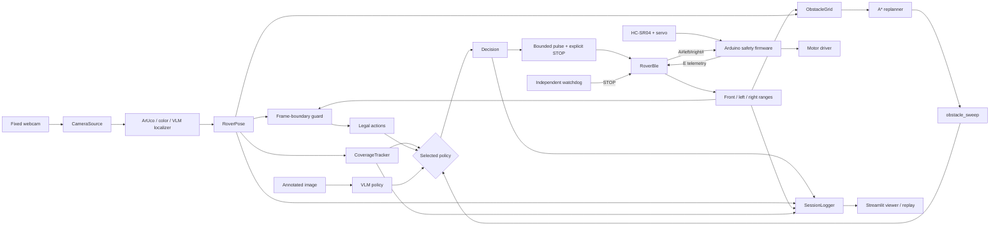
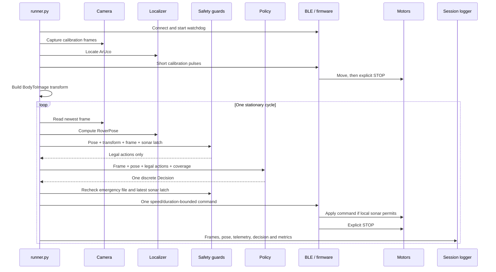
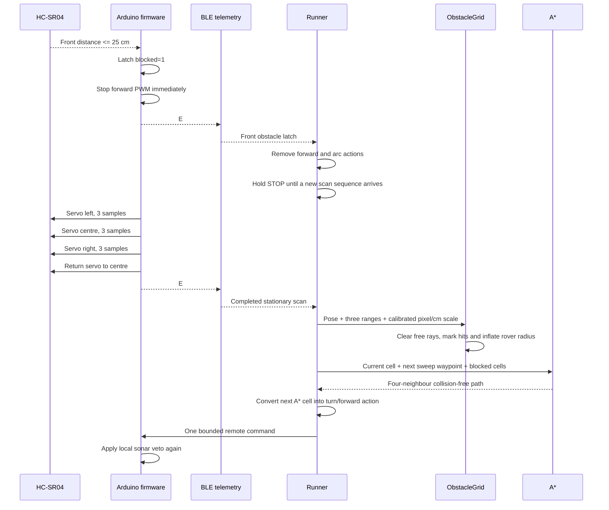
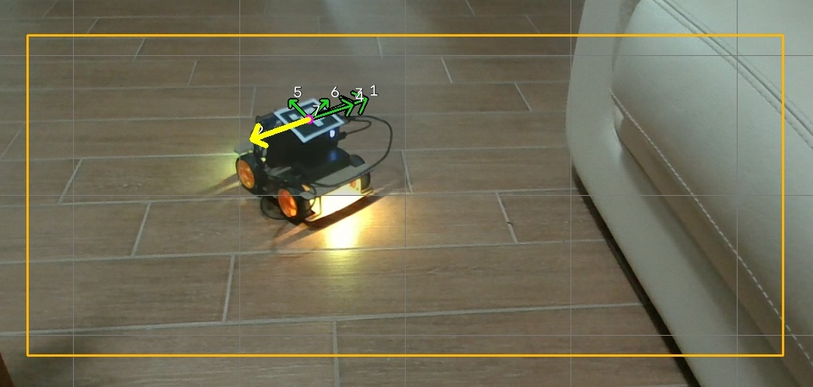
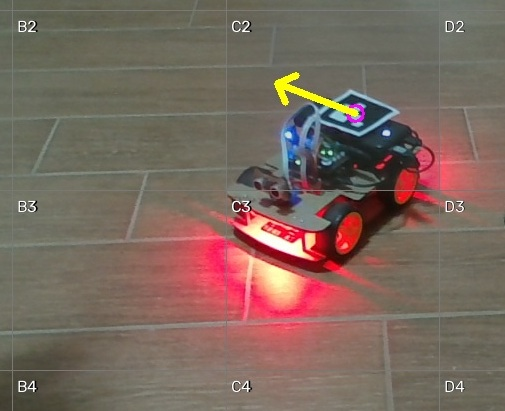
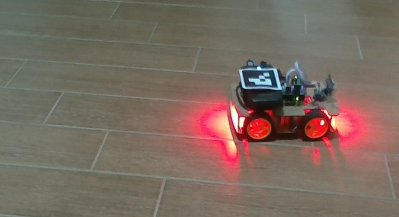
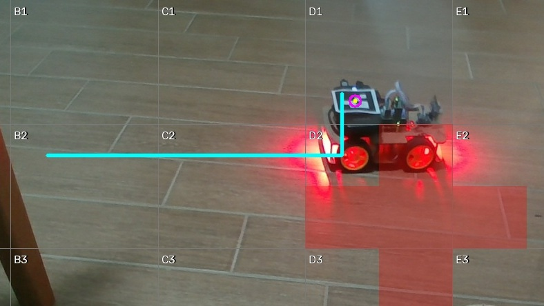
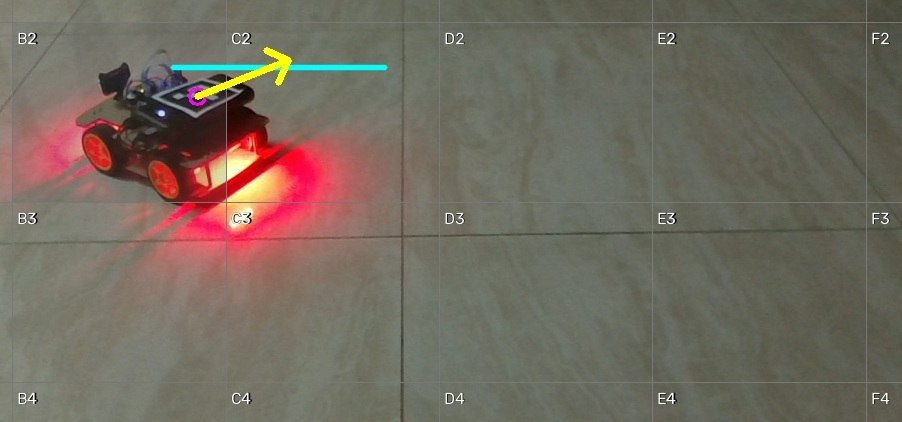

# VLA Rover Explorer

*A hybrid vision-language-action autonomy stack*

`rover-explorer` is a safe discrete control stack for a Freenove 4WD Arduino rover observed by a fixed PC webcam. It supports a local Ollama vision-language-action policy, deterministic lawnmower coverage, and ultrasonic occupancy mapping with A* detours. Every decision boundary is stationary: the program captures and localizes, narrows the action set with geometric and ultrasonic guards, asks the selected policy for one action, sends one timed BLE motor pulse, explicitly stops, and waits for the scene to settle. The project remains deliberately comparative—ArUco and classical policies expose where a VLM helps, where its spatial reasoning does not, and by how much.

## Dedication

> To my twelve-year-old brother and to every young person who prefers doing to
> merely dreaming: who builds with patient hands, who learns through mistakes,
> who discovers by touching and making. Your hunger to create and to know is our
> truest promise: your hands and hearts will mend the future, making it cleaner,
> fairer, free from every kind of pollution. This is for you, who already
> imagine a different tomorrow, with all our faith and hope.

## Safety model

The camera frame is the safety envelope. With the default `guard.margin_frac: 0.12`, translating actions whose calibrated prediction approaches the inset boundary are removed before any policy sees them. A small calibration-relative allowance covers pulse timing and wheel-slip error. Turns remain legal because they do not translate the rover. If localization is lost, only `BACKWARD` and `STOP` remain legal; recovery never turns while blind.

Motors never run while Ollama is thinking. Every pulse has a `finally` stop, disconnect stops first on every path, and an independent two-second watchdog sends `A#0#0#` if completed-pulse heartbeats cease. This is a practical safety layer, not a formal physical guarantee: test slowly, keep a hand near power, and increase the margin for oblique views or high slip.

## Project architecture

The system is split into two safety domains. The Arduino firmware owns the
low-latency ultrasonic stop and can veto forward motor commands without the PC.
The PC owns localization, coverage, policy selection, obstacle mapping, A*,
logging, and bounded BLE pulses. Either side can stop the rover; neither side
can force the other to accept an unsafe forward command.



`vlm`, `sweep`, and `obstacle_sweep` are alternative policies. The current
`obstacle_sweep` path is deterministic and uses ArUco plus ultrasonic readings;
it does not require Ollama. The VLM policy can reason about image semantics, but
it is not part of the hard collision-safety boundary.

### Module responsibilities

| Module | Responsibility |
|---|---|
| `runner.py` | Async lifecycle, calibration, stationary decision loop, final safety checks and CLI |
| `camera.py` | Latest-frame webcam capture, simulator source and offline replay |
| `localize.py` | ArUco, colour-blob and coarse VLM localization producing `RoverPose` |
| `calibrate.py` | Measures pixels per translation pulse, turn angle and forward image axis |
| `guard.py` | Removes actions that could cross the frame boundary or approach a front obstacle |
| `coverage.py` | Tracks visited, reachable and obstacle-excluded coverage cells |
| `obstacle.py` | Projects sonar rays into an image-space occupancy grid and runs four-neighbour A* |
| `policy.py` | Random, frontier, VLM, lawnmower sweep and obstacle-aware sweep policies |
| `motion.py` | Motor command encoding, bounded pulses, guaranteed stop and watchdog |
| `ble.py` | BT05 discovery, UART writes and battery/ultrasonic notification parsing |
| `annotate.py` | Coverage grid, legal arrows and chosen-action overlays |
| `logger.py` | Per-cycle JSONL/latest metadata and raw/annotated frame storage |
| `viewer.py` | Live session inspection, telemetry display and emergency-stop latch |
| `simulator.py` | Deterministic differential-drive rover, warped ArUco scene, slip and BLE latency |
| `firmware/...ino` | Always-on centred sonar guard and stationary left-centre-right scan; never plans motion |

## Autonomous guidance stack coverage

The table below maps the complete autonomous-guidance stack to the component
that currently covers each responsibility.

- ✅ **Covered:** implemented, integrated, and exercised by the test suite.
- 🟡 **Partial:** usable within documented limits, but not a complete automotive-grade implementation.
- ⚪ **Optional:** implemented as a selectable alternative, not active in every run.
- ❌ **Not covered:** intentionally outside the current system or still future work.

| Stack layer | Coverage | Covered by | Inputs → outputs | Current boundary |
|---|---:|---|---|---|
| Mission objective | ✅ | `CoverageTracker`, `runner.py` | Coverage target and cycle budget → terminate/continue | Optimizes visible reachable cells, not a geographic destination |
| Coverage strategy | ✅ | `CoverageSweep` / `ObstacleSweep` | Unvisited cells → serpentine waypoint sequence | Fixed lawnmower ordering; no task priorities |
| Behaviour selection | ⚪ | `VlmExplorer`, `FrontierGreedy`, `RandomWalk` | Image, pose, legal actions and coverage → one action | Exactly one policy is selected per run |
| Semantic visual reasoning | 🟡 | `VlmExplorer` with `qwen2.5vl:3b` | Annotated camera image → numbered action and reason | Advisory policy only; latency or malformed output causes `STOP` |
| Global/local path planning | ✅ | `ObstacleSweep`, `ObstacleGrid.astar()` | Current cell, target cell and blocked cells → four-neighbour A* path | Image-space grid; no continuous curvature or optimal-time trajectory |
| World/occupancy model | 🟡 | `ObstacleGrid`, `CoverageTracker` | Sonar rays and visited poses → short-lived free/occupied/visited cells | Local 2D map; obstacles expire and the map is not persistent SLAM |
| Obstacle perception | ✅ front / 🟡 sides | Arduino HC-SR04 scan | Front range while moving; left/centre/right while stopped → BLE telemetry | No rear sensing; lateral ranges are available only during a stationary scan |
| Semantic obstacle classification | ❌ | — | Object identity/material → traversability class | The VLM currently does not write semantic labels into `ObstacleGrid` |
| Localization | ✅ | `ArucoLocalizer` | Webcam frame → centre, heading and confidence | Marker must remain sharp and visible |
| Alternative localization | ⚪ | `ColorBlobLocalizer`, `VlmLocalizer` | Frame → position or coarse grid cell | Colour has no heading; VLM localization is too coarse for the safety reference |
| Motion-model calibration | ✅ | `calibrate.py`, `BodyToImage` | Observed short pulses → pixels/pulse, radians/pulse and forward axis | Image-space model; ultrasonic scale still needs `cm_per_translation_pulse` |
| Sensor fusion | 🟡 | `ObstacleSweep.update_obstacles()` | ArUco pose + sonar ranges + motion scale → projected obstacle cells | Deterministic projection, not probabilistic filtering or covariance fusion |
| Trajectory tracking | 🟡 | Closed-loop policy cycle | A* next cell + current heading → repeated turn/forward pulses | Discrete waypoint following; no continuous PID/MPC controller |
| Frame-boundary avoidance | ✅ | `guard.allowed_actions()` | Pose + calibrated transform + frame margin → legal action set | Protects the camera envelope, not obstacles outside the image |
| Collision stop | ✅ | Arduino firmware + Python ultrasonic guard | Range/latch → immediate PWM stop and forward/arc veto | HC-SR04 is the hard front safety layer; transparent/soft objects may be missed |
| Motor actuation | ✅ | `motion.py`, `ble.py`, Arduino motor driver | Discrete action → bounded wheel PWM pulse → explicit stop | Open-loop wheel speed; no encoders or wheel odometry |
| Runtime supervision | ✅ | `MotionWatchdog`, `finally` stop, BLE disconnect stop, emergency latch | Timeout/error/operator request → `A#0#0#` | Practical fail-safe design, not safety-certified hardware |
| Observability and replay | ✅ | `SessionLogger`, `viewer.py`, `ReplaySource` | Frames, poses, actions, sonar and metrics → JSONL/JPEG/dashboard | Replay reproduces perception/policy analysis, not physical wheel dynamics |
| Dynamic-obstacle prediction | ❌ | — | Tracked velocity → future collision prediction | A* reacts to the latest map and replans; it does not predict motion |
| Metric SLAM / persistent map | ❌ | — | Multi-frame landmarks/odometry → reusable metric world map | Fixed-camera image coordinates are used instead |

### Stack components

<table>
  <tr>
    <td width="50%" valign="top">
      <strong>SENSING — ✅ Covered</strong><br><br>
      • Fixed PC webcam at 1280×720<br>
      • HC-SR04 centred while moving<br>
      • HC-SR04 left/centre/right scan while stopped<br>
      • Battery voltage telemetry over BLE<br><br>
      <em>Not present: wheel encoders, rear range sensor, IMU and depth camera.</em>
    </td>
    <td width="50%" valign="top">
      <strong>PERCEPTION — 🟡 Partial</strong><br><br>
      • OpenCV ArUco marker detection<br>
      • Optional HSV colour-blob detection<br>
      • Ultrasonic obstacle-hit detection<br>
      • Optional <code>qwen2.5vl:3b</code> visual reasoning<br><br>
      <em>The VLM understands the annotated image but does not yet classify obstacles in the occupancy map.</em>
    </td>
  </tr>
  <tr>
    <td width="50%" valign="top">
      <strong>LOCALIZATION — ✅ Covered</strong><br><br>
      • Primary: <code>ArucoLocalizer</code><br>
      • Output: centre, heading and confidence<br>
      • Alternatives: colour position or coarse VLM grid cell<br>
      • Fixed-camera image coordinates<br><br>
      <em>Requires a visible marker; no metric SLAM or persistent world pose.</em>
    </td>
    <td width="50%" valign="top">
      <strong>MOTION ESTIMATION — ✅ Covered</strong><br><br>
      • Startup pulse calibration<br>
      • <code>BodyToImage</code> transform<br>
      • Pixels per forward pulse<br>
      • Radians per turn pulse<br>
      • Forward axis in the camera image<br><br>
      <em>Physical sonar projection additionally uses configured centimetres per pulse.</em>
    </td>
  </tr>
  <tr>
    <td width="50%" valign="top">
      <strong>WORLD MODEL — 🟡 Partial</strong><br><br>
      • 6×4 visited-coverage grid<br>
      • Configurable 12×8 obstacle grid<br>
      • Free sonar rays and occupied endpoints<br>
      • Rover-radius obstacle inflation<br>
      • Time-limited obstacle observations<br><br>
      <em>Local image-space model only; no persistent semantic or metric map.</em>
    </td>
    <td width="50%" valign="top">
      <strong>PLANNING — ✅ Covered</strong><br><br>
      • Serpentine lawnmower coverage<br>
      • Four-neighbour A* detours<br>
      • Frontier-greedy baseline<br>
      • Replanning after every bounded pulse<br><br>
      <em>No dynamic-obstacle prediction, continuous trajectory optimization or curvature constraints.</em>
    </td>
  </tr>
  <tr>
    <td width="50%" valign="top">
      <strong>BEHAVIOUR / DECISION — ✅ Covered</strong><br><br>
      • <code>obstacle_sweep</code> for deterministic autonomous coverage<br>
      • <code>sweep</code>, <code>frontier</code> and <code>random</code> baselines<br>
      • Optional <code>VlmExplorer</code> action selection<br>
      • Guard-approved discrete actions only<br>
      • Conservative <code>STOP</code> on invalid VLM output<br><br>
      <em>Only one policy is active during a run.</em>
    </td>
    <td width="50%" valign="top">
      <strong>TRACKING / CONTROL — 🟡 Partial</strong><br><br>
      • Heading error measured after every frame<br>
      • Discrete left/right alignment<br>
      • One forward pulse toward the next A* cell<br>
      • Explicit stop and settle between decisions<br><br>
      <em>No wheel feedback, PID, MPC or continuous path tracking.</em>
    </td>
  </tr>
  <tr>
    <td width="50%" valign="top">
      <strong>SAFETY — ✅ Covered</strong><br><br>
      • Calibrated frame-boundary guard<br>
      • Local Arduino ultrasonic stop below 25 cm<br>
      • Python forward/arc sonar veto<br>
      • Independent motion watchdog<br>
      • Stop on cancellation, disconnect and emergency latch<br><br>
      <em>Practical layered safety, not certified functional safety.</em>
    </td>
    <td width="50%" valign="top">
      <strong>ACTUATION — ✅ Covered</strong><br><br>
      • BT05 BLE UART transport<br>
      • <code>A#left#right#</code> motor protocol<br>
      • Arduino direction and PWM outputs<br>
      • Speed- and duration-bounded motor pulses<br>
      • Firmware-level command veto<br><br>
      <em>Open-loop wheel power without measured wheel velocity.</em>
    </td>
  </tr>
  <tr>
    <td width="50%" valign="top">
      <strong>OBSERVABILITY — ✅ Covered</strong><br><br>
      • Raw and annotated camera frames<br>
      • JSONL cycle telemetry and decisions<br>
      • Sonar, battery, coverage and guard metrics<br>
      • Streamlit live viewer and emergency latch<br>
      • Replay source and deterministic simulator<br><br>
      <em>Physical dynamics cannot be reproduced exactly by replay.</em>
    </td>
    <td width="50%" valign="top">
      <strong>NOT YET COVERED — ❌</strong><br><br>
      • Metric SLAM and reusable maps<br>
      • Dynamic-obstacle tracking and prediction<br>
      • VLM semantic labels fused into the obstacle map<br>
      • Rear and continuous lateral sensing<br>
      • Encoder odometry and continuous closed-loop control<br>
      • Safety-certified hardware supervision
    </td>
  </tr>
</table>

### Where the VLM is used

| Function | VLM role |
|---|---|
| Action selection with `--policy vlm` | Reads the annotated frame and selects one guard-approved numbered action |
| Explanation | Returns a short reason and confidence, stored in the session log |
| Coarse localization with `--localizer vlm` | Optional experimental grid-cell estimate; not recommended for safety |
| Boundary safety | No role: deterministic geometry removes unsafe actions before prompting |
| Emergency ultrasonic stop | No role: executed locally by Arduino and checked again by Python |
| Occupancy mapping | No role yet: sonar measurements populate the grid |
| A* planning | No role: `obstacle_sweep` runs deterministic A* and does not call Ollama |
| Motor timing and watchdog | No role: deterministic bounded pulses and independent stop paths |

This separation is intentional. The VLM can contribute semantic judgement and
human-readable reasoning, but malformed output, a timeout, or a missed visual
obstacle cannot bypass the geometric guard or the local ultrasonic stop.

### Project layout

```text
rover-explorer/
├── config.yaml                         # simulator/default settings
├── config.hardware.yaml                # physical rover and ultrasonic/A* settings
├── firmware/
│   └── Ultrasonic_Safety_Remote_Car/
│       └── Ultrasonic_Safety_Remote_Car.ino
├── rover_explorer/
│   ├── runner.py                       # application entry point
│   ├── camera.py / localize.py         # perception
│   ├── calibrate.py                    # body-to-image motion model
│   ├── guard.py / motion.py / ble.py   # safety and actuation
│   ├── coverage.py / obstacle.py       # world state and A*
│   ├── policy.py                       # decision policies
│   ├── annotate.py / logger.py         # observability
│   └── simulator.py / viewer.py        # testing and monitoring
└── tests/                              # unit, safety and simulated end-to-end tests
```

## Dataflow

### Startup and normal decision cycle



The rover is stationary during capture, localization, VLM inference and A*
planning. Only one bounded action crosses the BLE boundary per cycle. A fresh
frame is captured after the motors have stopped and the configured settle time
has elapsed.

### Obstacle stop, scan and A* replan



The occupancy map is deliberately short-lived: obstacle hits expire after
`ultrasonic.obstacle_ttl_cycles`, and every new ray clears cells observed as
free. Confirmed obstacle cells are excluded from the reachable coverage
denominator. A* is recalculated after every pulse rather than executing a long
open-loop path.

### Core data objects

| Data | Producer | Main consumers |
|---|---|---|
| BGR camera frame | `CameraSource` | localizer, annotation, VLM, logger |
| `RoverPose(centre, heading, confidence)` | localizer | guards, coverage, sonar projection, policies |
| `BodyToImage` | calibration | motion prediction, guards and centimetre-to-pixel scale |
| Legal `Action` list | frame and ultrasonic guards | every policy |
| `E#front#blocked#left#right#sequence#` | Arduino firmware | BLE parser, final action veto, obstacle mapper, logger |
| Occupied/inflated grid | `ObstacleGrid` | A*, annotated red overlay |
| A* path | `ObstacleSweep` | next discrete action, cyan overlay, decision reason |
| `Decision` | selected policy | pulse executor and session logger |
| `cycles.jsonl` record | `SessionLogger` | evaluation, debugging, replay and viewer |

## Project in action

The following examples are copied from real hardware sessions, not from the
simulator. Their matching JSONL records were used to verify the action, sonar
state, selected policy and explanation shown below.

### VLM action selection

<p align="center">
  
</p>

The magenta point is the localized ArUco centre, the orange rectangle is the
safe motion envelope, and the numbered green arrows are the only actions shown
to the VLM. The yellow overlay is the selected action. In this cycle the model
returned choice `2`, corresponding to `backward`, with the reason: “move
backward to avoid the couch and find open space.” The geometric guard had
already validated every displayed candidate before the image was sent to
Ollama.

<sub>Source: session `20260825-191323`, cycle 0.</sub>

### Closed-loop sweep waypoint

<p align="center">
  
</p>

The labelled 6×4 grid is the coverage objective. ArUco supplies centre and
heading, while `CoverageSweep` selects the next cell in alternating rows. The
yellow arrow shows the single bounded forward pulse chosen toward waypoint
`B1`; after that pulse the rover stops, captures another frame and corrects its
heading again.

<sub>Source: session `20260825-194623`, cycle 4.</sub>

### Ultrasonic stop and occupancy-map update

<table>
  <tr>
    <td width="50%" align="center"><strong>Raw camera frame</strong></td>
    <td width="50%" align="center"><strong>Same cycle after mapping</strong></td>
  </tr>
  <tr>
    <td width="50%" valign="top">
      
    </td>
    <td width="50%" valign="top">
      
    </td>
  </tr>
</table>

At 25 cm the Arduino asserted its local obstacle latch and stopped forward
motion. Python then removed `forward`, `arc_left` and `arc_right`, so this cycle
logged `STOP` while waiting for a completed stationary left-centre-right scan.
Red cells show sonar hits inflated by the configured rover radius; the cyan
polyline is the A* route known at that instant. The raw/annotated pair makes
clear which information comes from the camera and which is added by the control
stack.

<sub>Source: session `20260825-200739`, cycle 10.</sub>

### Following the replanned A* path

<p align="center">
  
</p>

After a completed sonar scan, `ObstacleSweep` projects the ranges into the map
and replans. The cyan line is the collision-free cell path; the yellow arrow is
only the next forward pulse, not an open-loop trajectory. This cycle used scan
sequence `47`, measured 60 cm in front and selected `forward` toward sweep
waypoint `C2`.

<sub>Source: session `20260825-201459`, cycle 2.</sub>

### Overlay legend

| Overlay | Meaning |
|---|---|
| Magenta point | ArUco-derived rover centre |
| Yellow arrow | Action selected for the next bounded pulse |
| Green numbered arrows | Guard-approved candidates exposed to the VLM |
| Orange rectangle | Safe camera-frame envelope |
| Labelled grid | Coverage cells and waypoint coordinates |
| Red cells | Ultrasonic obstacle hits inflated by rover clearance |
| Cyan polyline | Current four-neighbour A* route |

## Install

Requires Python 3.11 or newer.

```powershell
python -m venv .venv
# Activation is optional; this works even when PowerShell blocks scripts:
.\.venv\Scripts\python.exe -m pip install -e ".[dev]"
```

To activate the environment in only the current PowerShell process, without
changing the machine or user execution policy, use:

```powershell
Set-ExecutionPolicy -Scope Process -ExecutionPolicy Bypass
.\.venv\Scripts\Activate.ps1
```

The leading directory is `.venv`, including the dot. Commands using `venv`
without the dot refer to a different, nonexistent directory.

OpenCV must include the contrib modules because localization uses `cv2.aruco`; the declared `opencv-contrib-python` package supplies them. For the optional dashboard, install `.[viewer]` too. Ollama is accessed only over HTTP—there is no PyTorch or Transformers dependency. Pull the configured model before a VLM run:

```powershell
ollama pull qwen2.5vl:3b
```

When the environment is not activated, replace `python` in the examples below
with `.\.venv\Scripts\python.exe` so packages are installed and run in the same
interpreter.

Every runtime control is in [config.yaml](config.yaml), including pulse speeds and durations, camera size, BLE identity, safety margin, coverage target, simulator imperfection, and Ollama endpoint/model.

For the physical rover in this repository's tested room setup, use
[`config.hardware.yaml`](config.hardware.yaml). It increases torque and settle
time, requests 1280×720 capture so the physical marker retains enough pixels,
and uses a 15% calibration-start margin. Calibration takes the median of
valid samples, tolerates transient outliers, and requires at least two valid
measurements. It avoids inverse "return" pulses because real wheel asymmetry made
those add drift rather than reliably restoring the starting position.
An inverse pulse is still mandatory when localization is actually lost after a
calibration action: forward is undone with backward and a left turn with a right
turn. The camera reacquires while stopped, then calibration retries with a shorter
pulse and normalizes the measurement to the configured runtime duration.

## Run with no hardware

The simulator generates an overhead scene, differential-drive motion, and a real warped ArUco marker. BLE latency and wheel slip are configurable.

```powershell
# Fast null baseline, including automatic calibration
python -m rover_explorer.runner --transport mock --localizer aruco --policy random --cycles 100 --session-dir sessions

# Strong classical baseline
python -m rover_explorer.runner --transport mock --localizer aruco --policy frontier --cycles 100 --session-dir sessions

# Local VLM with numbered-arrow prompting
python -m rover_explorer.runner --transport mock --localizer aruco --policy vlm --annotate arrows --cycles 100 --session-dir sessions

# Coarse labelled-grid prompting
python -m rover_explorer.runner --transport mock --localizer aruco --policy vlm --annotate grid --cycles 100 --session-dir sessions

# A* coverage pipeline (the default simulator has no synthetic sonar obstacle)
python -m rover_explorer.runner --transport mock --localizer aruco --policy obstacle_sweep --annotate grid --cycles 300 --session-dir sessions
```

Each run creates a timestamped directory containing `cycles.jsonl`, `latest.json`, and matching `raw/` and `annotated/` JPEGs. That directory is a complete offline replay input:

```powershell
python -m rover_explorer.runner --transport replay --session-dir sessions\20260825-120000 --localizer aruco --policy frontier --no-calibrate
```

Run the optional live viewer against the exact timestamped output directory:

```powershell
streamlit run rover_explorer/viewer.py
```

Its emergency-stop button creates an `EMERGENCY_STOP` latch in that session. The runner sees it at the next in-progress decision boundary, overrides the decision, and sends stop. Hardware power remains the fastest emergency stop.

## Real rover and ArUco marker

Print marker ID **0** from OpenCV's `DICT_4X4_50` dictionary at roughly 35–50 mm square, preserving its white quiet border. Print at 100% scale, cut around the outer white border, and tape it flat and rigidly to the top of the rover. Align the marker's top edge with the rover's forward direction. Change `localization.aruco_marker_id` if using another ID. The entire marker must remain visible; gloss, bent paper, and LED reflections reduce detection reliability.

Place the webcam fixed, roughly overhead or high-oblique, with the rover initially well inside the frame. Pair the BT05 in Windows, leave the stock rover firmware in manual mode, and run:

```powershell
python -m rover_explorer.runner --config config.hardware.yaml --transport ble --localizer aruco --policy vlm --annotate arrows --cycles 100 --session-dir sessions
```

For deterministic full-grid coverage, use the closed-loop lawnmower policy. It
follows alternating left-to-right and right-to-left rows, re-localizing after
every bounded pulse and stopping automatically when all configured cells have
been visited:

```powershell
python -m rover_explorer.runner --config config.hardware.yaml --transport ble --localizer aruco --policy sweep --annotate grid --cycles 300 --session-dir sessions
```

After flashing the ultrasonic safety firmware below, use `obstacle_sweep` for
the same coverage route with remote occupancy mapping and A* detours:

```powershell
python -m rover_explorer.runner --config config.hardware.yaml --transport ble --localizer aruco --policy obstacle_sweep --annotate grid --cycles 300 --session-dir sessions
```

Red cells in annotated frames are inflated obstacle regions; the cyan polyline
is the current A* route. When a front obstacle is detected, the PC waits for a
complete stationary sonar scan before issuing an escape turn.

The safety rectangle intentionally excludes the frame edges, so "full" means
all reachable grid cells inside that inset rather than placing the rover or its
marker on the image boundary.

Startup calibration waits up to `calibration.localization_timeout_seconds` for camera exposure and localization, then measures three short forward pulses and three left turns. It aborts if localization fails, the rover starts too near an edge, translation is below the noise floor, or angular change cannot be measured. On failure it saves `calibration_failed.jpg` in the reported timestamped session directory. Inspect that image to confirm the selected camera sees a sharp, fully visible marker. `--no-calibrate` is intended for replay and controlled diagnostics, not a first hardware run.

On Windows, the CLI explicitly resets an accidental STA/GUI COM apartment before
Bleak scans. This prevents Bleak's `Thread is configured for Windows GUI but
callbacks are not working` error in a console process. If scanning then reports
that `BT05` was not found, confirm Windows Bluetooth is enabled, the module is
powered, and no serial/Bluetooth application is already connected to it.

For color localization, set the rover LED strip to a solid color with `C#3#r#g#b#` and tune the HSV thresholds in `config.yaml`. It provides position only. `VlmLocalizer` provides only a coarse grid-cell center and is intentionally a weak evaluation target; do not use it as the reference safety localizer.

## Hardware and firmware attribution

The physical platform used by this project is the **Freenove 4WD Car Kit for
Arduino**. Hardware layout, pin assignments, motor interface, RGB controller,
battery measurement, servo, ultrasonic sensor, and the original base firmware
refer to Freenove's upstream project:

- [Freenove/Freenove_4WD_Car_Kit on GitHub](https://github.com/Freenove/Freenove_4WD_Car_Kit/tree/master)

The firmware in
[`firmware/Ultrasonic_Safety_Remote_Car/Ultrasonic_Safety_Remote_Car.ino`](firmware/Ultrasonic_Safety_Remote_Car/Ultrasonic_Safety_Remote_Car.ino)
is derived from Freenove's `Multifunctional_RF24_Remote_Car.ino` and has been
modified for this project. The main changes are an always-on centred ultrasonic
guard, stop-only obstacle behaviour, a stationary left-centre-right scan,
extended BLE sonar telemetry, and removal of autonomous obstacle-avoidance motor
manoeuvres from the firmware. Route selection and deviation remain under the
remote Python controller.

The original Freenove attribution is retained in the sketch header. This
repository does not claim ownership of Freenove's hardware design or original
firmware; consult the upstream repository for its documentation and applicable
terms.

## Wire protocol

The UART characteristic is `0000ffe1-0000-1000-8000-00805f9b34fb`. Discovery falls back to a notify characteristic supporting either write mode. Writes prefer response when advertised and otherwise use write-without-response. All outbound commands are newline-terminated ASCII.

| Purpose | Wire command | Notes |
|---|---|---|
| Motors | `A#speedL#speedR#\n` | Each speed is -255..255; useful PWM begins near 60 |
| Explicit stop | `A#0#0#\n` | Sent after every pulse and before disconnect |
| Buzzer | `D#0#\n` or `D#1#\n` | Off/on |
| Solid LED color | `C#3#r#g#b#\n` | RGB channel values |
| Car mode | `H#mode#\n` | **Never sent by this project** |
| Battery notification | `I#millivolts#` | Parsed and displayed; normally arrives about every 3 seconds |
| Ultrasonic notification | `E#front#blocked#left#right#scan_sequence#` | Distances in cm and completed-scan counter |

The stock firmware only uploads sonar readings in `MODE_ULTRASONIC`, where it
also takes autonomous control of the motors. Flash
[`firmware/Ultrasonic_Safety_Remote_Car/Ultrasonic_Safety_Remote_Car.ino`](firmware/Ultrasonic_Safety_Remote_Car/Ultrasonic_Safety_Remote_Car.ino)
to replace that behaviour with an always-on local stop guard. While the rover
is moving, the modified firmware keeps the sonar centred and samples it
approximately every 60 ms. It stops forward motion at 25 cm and requires three
front readings at or above 35 cm before clearing the latch. Once blocked and
stationary, the servo scans 50 degrees left, centre, and 50 degrees right using
three samples per direction, then returns to centre. The scan is implemented as
a state machine, so BLE command handling continues between readings.

The firmware never starts a reverse, turn, or forward movement by itself.
Reverse and in-place turns remain available to the remote controller so A* can
execute a detour. Adjust `SONAR_STOP_DISTANCE_CM` and
`SONAR_CLEAR_DISTANCE_CM` in the sketch only after low-speed testing.

The Python BLE transport parses this telemetry. While `blocked=1`, the runner
removes forward and arc actions and checks the latch again immediately before a
motor pulse. Front, left, and right distances, scan sequence, and latch state are
saved in every cycle log and shown in the optional viewer. `obstacle_sweep`
projects sonar rays into a configurable 12x8 image-space occupancy grid, inflates
hits by the configured rover radius, and replans a four-neighbour A* path after
every pulse. The scale parameter `ultrasonic.cm_per_translation_pulse` must match
the approximate physical travel of one configured forward pulse.

## Evaluation

Use identical configuration, simulator seed, coverage grid, and 100-cycle limit for policy comparisons. The repository does not fabricate VLM benchmark numbers when Ollama/model availability is unknown. Fill the VLM row from the resulting final JSONL coverage snapshot; repeat multiple seeds before drawing conclusions. Frontier greedy is expected to beat both the random walk and the small VLM on this geometric coverage task—the meaningful result is the measured gap, not making the VLM win.

| Policy | Coverage after 100 cycles | Status |
|---|---:|---|
| Random walk | Environment-dependent | Run the first hardware-free command above |
| Frontier greedy | Environment-dependent | Expected strongest; uses localization and calibration only |
| `qwen2.5vl:3b` VLM | Not measured in this checkout | Requires the configured local Ollama model |

Localization should be scored on the same simulated frames as Euclidean center error and grid-cell distance against ArUco. The deterministic conversion test uses a stub answer `C2` on a 600×400 frame: it maps to `(250, 150)` exactly; against the centered ArUco rover at `(300, 200)`, that deliberately wrong label is **70.7 px / 1.41 grid cells** away. This validates conversion, not model quality. Real VLM localization remains unmeasured until a local Ollama model is evaluated, and is expected to be substantially worse than ArUco.

| Localizer | Error vs ArUco (pixels) | Error (grid cells) |
|---|---:|---:|
| ArUco on simulator | < 2 px (test tolerance) | 0 |
| VLM stub fixture (`C2`) | 70.7 px | 1.41 |
| Real `qwen2.5vl:3b` | Not measured | Not measured |

Run all checks with:

```powershell
python -m pytest -q
```

The current 25-test suite covers newline protocol and extended sonar telemetry,
stop-on-disconnect, geometric and ultrasonic guards, calibration recovery,
ArUco and grid-label localization, VLM fallbacks, occupancy-ray projection,
obstacle inflation, A* routing, and complete simulated runs of both `sweep` and
`obstacle_sweep`.
